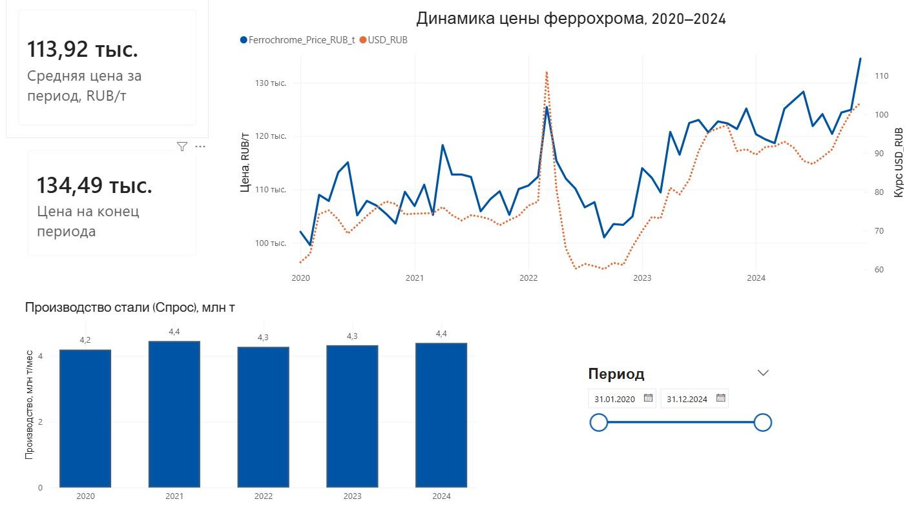
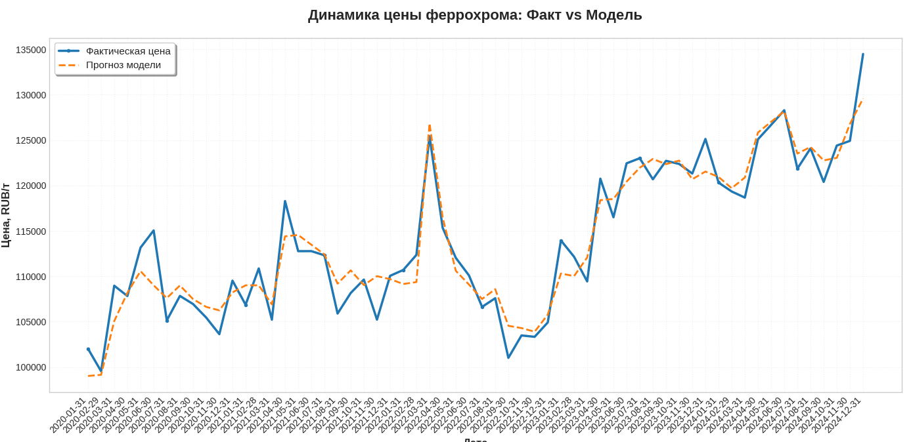

# 🔮 Ferrochrome Price Analysis & Forecasting for CHEMK

End-to-end analytics project: identifying price drivers for ferrochrome and building predictive models using Python (regression analysis) and Power BI (interactive dashboard).

## 📊 Dataset Sources

| File | Source | Description |
|------|--------|-------------|
| `USD/RUB Exchange Rate` | [Yahoo Finance via yfinance](https://finance.yahoo.com/quote/USDRUB=X) | Daily USD/RUB exchange rates (2020–2024), aggregated to monthly averages |
| `Steel Production (Russia)` | [World Bank: Steel Production](https://data.worldbank.org/indicator/ST.STL.MRCH.ZS?locations=RU) | Annual steel production data (50.5–54.2M tons/year), interpolated to monthly with seasonal adjustment |
| `Chrome Ore Price` | Simulated based on industry trends | Monthly chrome ore prices ($/ton) with realistic trend ($120–$160) and noise |
| `Ferrochrome Price` | Generated using economic model | Target variable: ferrochrome price (RUB/ton) based on currency, demand, and raw material factors |

## 📈 Key Visualizations

### Interactive Power BI Dashboard



Multi-factor analysis: ferrochrome price dynamics vs USD/RUB exchange rate, with steel production trends and interactive period filtering.

### Model Performance: Actual vs Predicted



Linear regression achieves **R² = 0.926** and **MAPE = 1.6%**, demonstrating strong predictive capability for commodity price forecasting.

### Factor Correlation Analysis

Correlation analysis reveals strong relationship between ferrochrome price and USD/RUB exchange rate (+426 RUB/ton per 1 RUB weakening), while steel production shows stable demand patterns (~4.0–4.5M tons/month).

## 🚀 How to Reproduce

1. **Clone the repository:**
    ```bash
    git clone <your-repo-url>
    cd CHEMK_Analysis_Project
    ```

2. **Install dependencies:**
    ```bash
    pip install -r requirements.txt
    ```

3. **Run the analysis notebook:**
    - Open `CHEMK_Ferrochrome_Price_Analysis.ipynb` in Jupyter Lab / VS Code / Google Colab
    - Execute all cells (`Kernel → Run All`)
    - The script will automatically:
      - Download USD/RUB data from Yahoo Finance
      - Generate steel production and chrome ore data
      - Create `CHEMK_Full_Dataset.csv`

4. **Open the Power BI dashboard:**
    - Launch `CHEMK_Ferrochrome_Dashboard.pbix` in Power BI Desktop
    - Use the period slider to filter data interactively

5. **Output:**
    - Enriched dataset: `CHEMK_Full_Dataset.csv` (60 months, 5 columns)
    - Trained regression model with performance metrics
    - Interactive dashboard with cross-filtering capabilities

### 📁 Project Structure

```text
├── CHEMK_Ferrochrome_Price_Analysis.ipynb      # Main analysis notebook (Python)
├── CHEMK_Ferrochrome_Dashboard.pbix            # Power BI interactive dashboard
├── CHEMK_Full_Dataset.csv                      # Generated: enriched dataset (60 months)
├── images/                                      # Visualization screenshots
│   ├── dashboard_preview.JPG                    # Power BI dashboard screenshot
│   └── model_fit.PNG                            # Model performance plot
├── requirements.txt                             # Python dependencies
├── .gitignore                                   # Files to exclude from version control
└── README.md                                    # This file
```

### 🎯 Key Objectives

1. Collect and preprocess macroeconomic data (exchange rates, steel production, raw material prices)
2. Build interpretable linear regression model to identify price drivers
3. Validate model quality using R², MAE, RMSE, MAPE, and VIF (multicollinearity check)
4. Create interactive Power BI dashboard for business stakeholders
5. Provide actionable recommendations for pricing strategy and risk management

### 📋 Requirements

- Python 3.10+
- pandas, numpy, matplotlib
- scikit-learn, statsmodels, yfinance
- Power BI Desktop (for dashboard visualization)
- Jupyter Lab, Google Colab or compatible environment

See `requirements.txt` for exact versions.

### 📈 Key Findings

- **Model Performance:** R² = 0.926 (explains 92.6% of price variance), MAPE = 1.6% (high accuracy for commodity forecasting)
- **Primary Price Driver:** USD/RUB exchange rate — every 1 RUB weakening increases ferrochrome price by ~426 RUB/ton
- **Demand Factor:** Steel production shows stable demand (~4.0–4.5M tons/month) with minor seasonal fluctuations
- **Raw Material Impact:** Chrome ore price contributes ~269 RUB/ton per $1 increase
- **Multicollinearity Check:** All VIF values < 2, confirming factor independence
- **Business Insight:** Price volatility is primarily currency-driven, not demand-driven — recommend hedging strategies for FX risk

### 📄 License

- **Analysis code:** MIT License
- **Source data:** Yahoo Finance (public domain), World Bank (CC BY 4.0)
- **Dashboard:** Free for educational and portfolio purposes

---

*Portfolio project by Evgeniya Stolyarova*
